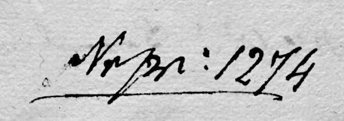

= Case File Organization and Document Identifiers

There so different numbers and stamps on the pages because *different offices/books* 
were keeping control of the same transaction. These are the most important ones:

== The Acten-Designation — the case file’s own “table of contents”

When a case file was opened (here, 1841–1842), a clerk wrote a *contents list* with brief
titles.  Each numbered entry in the contents list is composed of one or more documents;
for example, the contents list has these two documents listed under entries #2 and #3:

[cols="1a,6a",width="70%",options="noheader"]
|===
|Number|Documents
|1.
|xref:doc-01.adoc#doc-index-1-1[Vorstellung des Col. Krückeberg No 10 in Berenbusch------Anb.]

|2.
|xref:doc-02.adoc#doc-index-2-1[Bericht Amts Bückeburg]

|〃
|xref:doc-02.adoc#doc-index-2-2[Cpt. KRes. an dasselbe]

|3.
|xref:doc-03.adoc#doc-index-3-1[Vorst. des Colons Krückeberg]

|〃
|xref:doc-03.adoc#doc-index-3-2[Vortrag des GKR od Reck]

|〃
|xref:doc-03.adoc#doc-index-3-3[Cpt. KRes. an p Krückeberg]
|===

=== Cross-Referencing the Contents List to Its Documents

For each number in column one of the contents list, the first document listed will have
this number written in the upper right corner of the first page. This first document for
*number 2* in the able above is the xref:amt-decree.adoc[Bericht Amts Bückeburg] (the Report
of the Bückeburg Office), in and the upper right corner ofits  first page, you see *2*:

image::example-entry-num-on-doc.jpg[title="2" visible in right corner,link=self]

== Numbering Systems of the Rentkammer in Schaumburg-Lippe (Mid-19th Century)

=== Overview
During the mid-19th century, the Rentkammer (Chamber Treasury) in Schaumburg-Lippe
used parallel numbering systems to track petitions, reports, rescripts, and related acts.
Each number served a distinct bureaucratic purpose and helps reconstruct the flow of a case file.

=== The “Nr pr. \####” Numbers — Protocol / Register Numbers

* *Definition*: The entry number in the Rentkammer’s *Protokollbuch* (protocol book), a line-by-line ledger
  recording decisions and actions.

A protocol number was assigned once when the case was formally undertaken by the Rentkammer. In the case involving
Johann Heinrich Krückeberg request for a loan, *Nr pr: 1274* was written on the bottom of the first page of the of
his Octoboer 2, 1841, xref:doc-01.adoc[Petition].  Every subsequent document in the case (reports, cover slips,
rescripts, replies) still belonged to that protocol entry — but the number itself didn’t need to be re-written on
every single sheet.  So, *“Nr pr. 1274”* is the umbrella identifier under which the whole Krückeberg loan matter
was logged in the protocol book.  

* *Variants*: Appears as *Nr pr.* or *Num pr.*, with identical meaning.

=== The “NC \####” Numbers — Chamber Docket / Expedition Numbers

image::nc-xxxx.jpg[link=self]

The *NC ####* numbers appear in the upper left corner of the first page of each major document. They
are merely sequential numbers assigned by the Rentkammer as items were logged and handled during a given year.
The numbers increased throughout the year marking the chronological order of handling. 

=== Related Notations and Abbreviations

* *RC* = shorthand for *Rentkammer*. In text in the image below begins with *RC*:  
+
image::15-r-vertical.png[title="Text begins with RC.",link=self]
* *ad NC* or *ad Num Cam* = “in reference to NC \####”. It links a later follow-up document to an earlier one.
In the image below, *ad* appears above *Num: Cam: 5702*, meaning "concerning the Rentcammer document numbered 
5702". 
+
image::ad-nc.jpg[link=self]

=== Distinction Between the Two Systems

* The *NC number* was simply a running number the Rentkammer gave to each document as it came across their desk.
* The *Nr pr.* was a *protocol number*, assigned upon entry into the official ledger.  

=== Conclusion

The Rentkammer’s dual numbering system — NC docket numbers and Nr pr. protocol entries —
provided both an operational sequence of handling and a permanent ledger reference.
Together they allow today’s researcher to trace the administrative life-cycle of a petition
from initial submission, through treasury handling, to final rescript or repayment closure.
